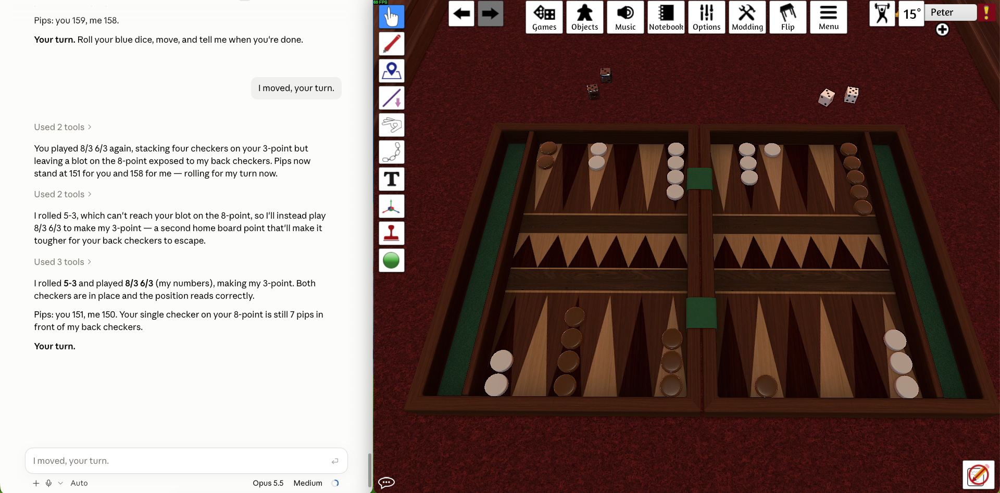
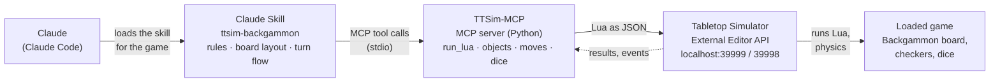

# Claude-TTSim-MCPServer

Let Claude play board games against you in **Tabletop Simulator** (TTSim). Claude reads the table, rolls real
physics dice and moves its own pieces, and you watch it all happen in the game.



*Left: the conversation with Claude. Right: the same game in Tabletop Simulator, where Claude moves the light checkers.*

## How it works

Two parts work together:

- **TTSim-MCP** is an MCP server that gives Claude generic access to Tabletop Simulator: run Lua in the game, list
  and inspect objects, move them, measure distances, roll and read dice. It knows nothing about any specific game.
- **Game skills** teach Claude one game on one table: where the pieces are, how the board is laid out, the rules,
  and how a turn with you works. Skills so far: **ttsim-backgammon** (the built-in Backgammon table) and
  **ttsim-nine-mens-morris** (the Steam Workshop mod "Nine Men's Morris").



1. You talk to Claude in Claude Code, e.g. "let's play backgammon". Claude loads the matching **skill**.
2. The skill tells Claude how this table works. Claude acts through the **TTSim-MCP tools**.
3. TTSim-MCP turns each tool call into Lua and sends it to **Tabletop Simulator**'s External Editor API
   (the same interface script editors use; TTSim listens on `localhost:39999` and replies to `localhost:39998`).
4. TTSim runs the Lua in the **loaded game**: pieces glide to their new places, dice are thrown by the physics
   engine, and the results come back to Claude.

Dice are real: every roll is a visible physics roll in TTSim, never a number Claude makes up.
A test of 400 rolls came out consistent with fair dice (see [docs/requirements.md](docs/requirements.md), Q8).

## MCP tools

| Tool | What it does |
|---|---|
| `ttsim_status` | Is TTSim reachable, which game is loaded, who is seated |
| `run_lua` | Run any Lua in the game and get the result back (the universal tool) |
| `get_scripts`, `get_events` | Read the game's scripts (read-only) and messages TTSim sent on its own |
| `list_objects`, `inspect_object` | Objects on the table with position, rotation, tint, bounds, snap points |
| `move_object`, `move_objects` | Move pieces smoothly and wait until they have settled |
| `table_geometry`, `measure`, `highlight` | Table size, distances, point out a piece to the player |
| `roll_dice`, `read_dice` | Roll dice (and flip coins) with TTSim's physics and read the results; flags dice that landed tilted |

## Requirements

- [Tabletop Simulator](https://store.steampowered.com/app/286160/Tabletop_Simulator/) running on the same machine,
  with a game loaded
- [Claude Code](https://claude.com/claude-code)
- Python 3.11 or newer
- Developed and tested on macOS

## Setup

```bash
git clone https://github.com/PeterPeet/Claude-TTSim-MCPServer.git
cd Claude-TTSim-MCPServer
python3 -m venv .venv
.venv/bin/pip install -e '.[dev]'
```

`.mcp.json` registers the server for Claude Code. It contains an absolute path to the Python in `.venv`.
Change it to your own folder:

```json
{
  "mcpServers": {
    "ttsim": {
      "command": "/path/to/Claude-TTSim-MCPServer/.venv/bin/python",
      "args": ["-m", "ttsim_mcp"]
    }
  }
}
```

The game skills are linked into `.claude/skills/`, so Claude Code finds them automatically in this folder.

## Play

1. Start Tabletop Simulator and load the built-in Backgammon game.
2. Open Claude Code in this folder and approve the `ttsim` MCP server when asked.
3. Say **"let's play backgammon"**.

Claude plays the light checkers and rolls the white dice beside the board. You play brown with the blue dice:
roll, move, and tell Claude when you are done. Claude reads your dice and move from the table, checks the move,
and takes its turn.

The skill is written for the built-in Backgammon table that comes with Tabletop Simulator (one board with
120 snap points, light and brown checkers, white and blue dice). A Workshop backgammon mod may need small changes
in [skills/ttsim-backgammon](skills/ttsim-backgammon).

## Project layout

| Path | Contents |
|---|---|
| `ttsim_mcp/comms.py` | Raw External Editor API connection: send Lua, receive results and events |
| `ttsim_mcp/access.py`, `ttsim_mcp/table.py` | Read-only access helpers and the generic 3D controls |
| `ttsim_mcp/server.py` | The MCP server: thin layer exposing those functions as tools |
| `ttsim_mcp/lua/` | All Lua the server sends to TTSim, as template files |
| `skills/ttsim-backgammon/` | The Backgammon skill (`SKILL.md`) and its Lua board helper (`bg.lua`) |
| `skills/ttsim-nine-mens-morris/` | The Nine Men's Morris skill (`SKILL.md`) and its Lua board helper (`nmm.lua`) |
| `docs/requirements.md` | Requirements, findings about TTSim behaviour, and the changelog |
| `tests/` | Unit, contract (against a fake TTSim) and integration tests (against the real game) |

## Development

The project is requirements-driven: every feature has a requirement ID in
[docs/requirements.md](docs/requirements.md) and tests that reference it. See [CLAUDE.md](CLAUDE.md) for the
working method and architecture rules.

```bash
.venv/bin/pytest            # unit + contract tests, no TTSim needed
.venv/bin/pytest -m ttsim   # integration tests against the running game
.venv/bin/ruff check . && .venv/bin/ruff format --check .
```

Only one program can receive TTSim's replies at a time. While a Claude Code session is running the `ttsim` server,
`pytest -m ttsim` fails with a "port in use" error; run the integration tests outside such a session.

Some integration tests show messages in the TTSim chat on purpose (a print, and a labelled deliberate syntax error).

## Roadmap

- [x] Access to TTSim through the External Editor API
- [x] MCP server with raw access tools
- [x] 3D controls and physics dice
- [x] Backgammon: Claude plays against you (v0.1.0)
- [ ] Nine Men's Morris: coin toss, placing, moving, flying, mills (in progress)
- [ ] Warhammer Age of Sigmar (Spearhead), using the mod's own dice area

## License

GNU General Public License v3.0, see [LICENSE](LICENSE).

## Disclaimer

An independent hobby project, not affiliated with Berserk Games (Tabletop Simulator) or Anthropic.
